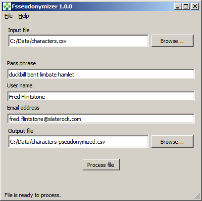

[Table of contents](_tableOfContents.md)  
Previous: [Using the program](usage.md) | Next: [Using the application from the command line](commandline.md)

# _Fsseudonymizer:_ The user interface

_Fsseudonymizer_ is designed to be simple to use.  The image below shows the graphical user interface.  To process a data file, simply complete the requested information:



**Input file**: Click the ```Browse``` button to select an input file to process.  Note the [input file requirements](usage.md#markdown-header-input-file-formats) on the previous page.

**Pass phrase**: Enter your pass phrase here.  [As described earlier](usage.md#markdown-header-the-pass-phrase), a good pass phrase should be a random sequence of words which would be difficult to guess, should be treated securely by data providers, and should **not** be provided to data users.

Once entered, _Fsseudonymizer_ will store your pass phrase for future use.  If you generate psuedonymous data for different data users or projects, it might be a good idea to use a different pass phrase for each user or project.

**User name** and **Email address**: These provide contact details that will be incorporated into the metadata section of a _Fsseudonymizer_ output file, as described on the [previous page](usage.md#markdown-header-output-file-contents).

**Output file**: Select the name and location for the output file to be generated by _Fsseudonymizer_.

Once all of the settings above have been specified, the **Process file** button will be enabled.  Click this button to process the input file.

If all goes well, a message will be displayed indicating that an output file was successfully generated.

If any problems were encountered with the input file, these will be displayed.  Any such errors must be addressed before an output file can be produced.